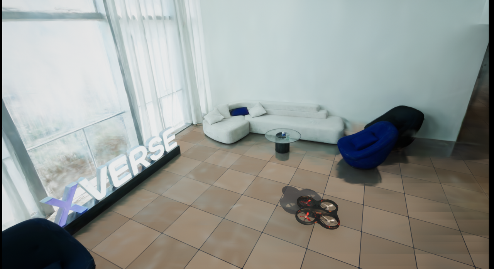
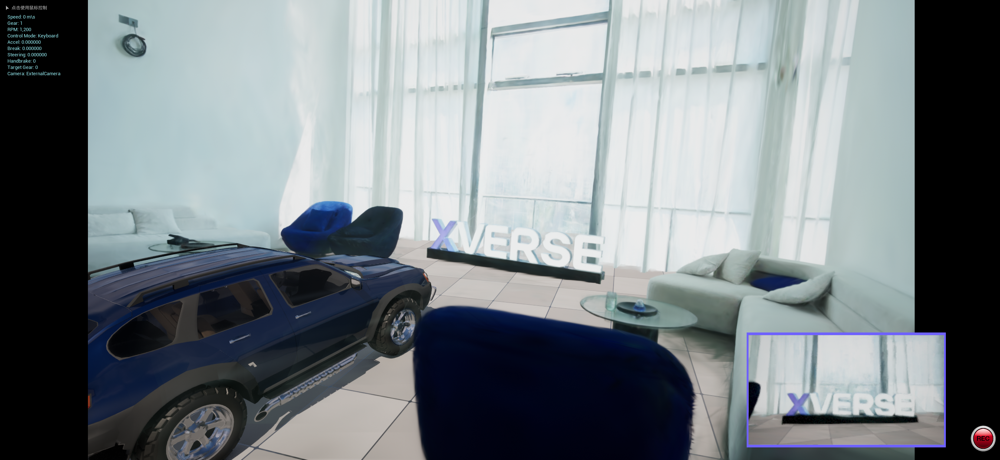
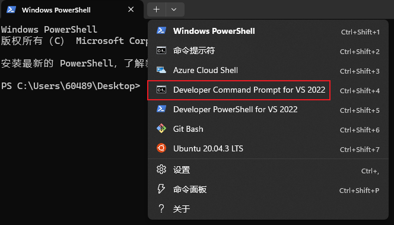

# XV3DGS-AirSim
搭建一个在Real2Sim模式中开飞机/汽车的workflow

## 依赖
- Windows 10 or newer
- Unreal Engine 5.2 , 建议在Epic启动器安装
- Visual Studio 2022 ，仅提供编译环境、不再在上面GUI开发，建议就用2022不要用新版，并且安装基于C++的桌面工具、VS MSVC v143 14.37.32822 、VS 2022 C++ x64/x86 build tools 
- Visual Studio Code
- Several good videos for colmap (optional)

## 使用简介
**我们需要使用UE5.2 + Windows**，结合[官方教程](https://github.com/xverse-engine/XScene-UEPlugin/blob/main/UEPlugin/README_CN.md)，在官方release界面下载5.2版本的插件，并解压放置在`Plugins`文件夹内，然后启动projects即可，接下来我们不需要默认使用官方提供的[windows本地训练3DGS脚本](https://github.com/xverse-engine/XScene-UEPlugin/tree/main/UEPlugin#local-training-on-windows-platform)，而也可以使用我们自己的方法，只要注意官方说的[事项](https://github.com/xverse-engine/XScene-UEPlugin/blob/main/UEPlugin/Media/CaptureDOC_CN.md)合理拍摄一个mp4，最终就能训练得到一个还可以的相应ply点云文件，并用[XV3DGS插件](https://github.com/xverse-engine/XScene-UEPlugin/blob/main/UEPlugin/README_CN.md#%E5%AF%BC%E5%85%A5%E4%BD%A0%E8%87%AA%E5%B7%B1%E7%9A%84-guassian-splatting-%E5%9C%BA%E6%99%AF)轻松导入到UE Editror中进行使用，这里官方还提供了[种种特性](https://github.com/xverse-engine/XScene-UEPlugin/tree/main/UEPlugin#feature-introduction)（如仿射变换、裁剪、打光、变色）,这里不做赘述。具体Airsim的非常详细的用法直接参考知乎大佬：[宁子安](https://www.zhihu.com/people/ningzian/posts), **强烈建议先看完再装**。




## 配置
安装完全部依赖之后，我们假设已经从自己拍摄（或自带）的视频中完成了相应的sfm和3dgs重建，并且得到了相应的ply点云文件，需要导入到一个UE工程里，并且兼顾Airsim原本功能的机器人控制。为此，给出一个示例用法(假设UE和项目都放在D盘），先下载项目
```powershell
cd D:\projects

git clone https://github.com/superboySB/XV3DGS-AirSim
```

打开`Developer Command Prompt for VS 2022`进行集成环境编译，注意UE 5.2无法支持visual studio的预装比较新的 MSVC compiler 14.4+，需要改一下编译器环境。这里如需切换盘符直接输入`D:`即可,运行编译脚本,请保持网络畅通
```powershell
"C:\Program Files\Microsoft Visual Studio\2022\Professional\VC\Auxiliary\Build\vcvars64.bat" -vcvars_ver=14.37.32822

# D：
cd .\projects\XV3DGS-AirSim\ProjectAirSim\

build.cmd simlibs_debug
```
可以回到`windows terminal`了，根据示例项目来生成visual studio工程文件,注意选定编译版本为`5.2`
```powershell
cd D:\projects\XV3DGS-AirSim\ProjectAirSim\unreal\Blocks


$env:UE_ROOT = "D:\games\UE_5.2"

.\blocks_genprojfiles_vscode.bat
```
然后在visual code里面用`open workspace from file`的方式打开`Blocks.code-workspace`，然后在单独的workspace中进行测试，注意仔细参考这里配置vscode: https://iamaisim.github.io/ProjectAirSim/development/use_source.html#vs-code-windows-linux

一定耐心等所有跟configuration相关的读条，然后一定要`build`一定`ctest`。完事后，可在GUI中打开UE editor


## 常见用法示例


然后右键源目录的`XV3DGS.uproject`,生成相应的VS工程索引
[](https://postimg.cc/0zYYXGw0)

打开`XV3DGS.sln`，注意等VS 2022左下角解析好了再操作，确保本项目是启动项目，然后以`Developer Editor`模式启动本地Windows调试器，会看到一个空白的地图
[](https://postimg.cc/Q98HbwLc)

将Game Mode设置为`AirSim Mode`
[](https://postimg.cc/LqMTH9fR)

其实此时我们也完全可以基于一个已有的umap来做（混合已有UE资产、3DGS资产和机器人都是没问题的），但这里我们假设是从0开始做，那我们新建一个开放世界的关卡，然后用XV3DGS插件导入一个我们喜欢的ply文件，这里我们下载3DGS常用的一些训好的ply文件(https://repo-sam.inria.fr/fungraph/3d-gaussian-splatting/datasets/pretrained/models.zip)，并选择`train`的相应ply文件进行导入
[](https://postimg.cc/N5dFspH0)

然后稍等就能看到一个生成好的结果，将里面的蓝图类拖进去。
[](https://postimg.cc/1fW9DXMR)

我们大概率需要好好去旋转、平移一下出现的uassets，使得地面能尽量贴合我们给的地面、找到比较清晰的渲染位置，此外，你还可以参考元象官方的[教程](https://github.com/xverse-engine/XV3DGS-UEPlugin)去裁剪、上色、打光等，基本可以看到一个这样的效果。（其实目前的插件不支持比较大的场景）
[](https://postimg.cc/75dXG123)

然后我们插入一个玩家出生点给我们的Airsim作为起始点
[](https://postimg.cc/2b7KF3p8)
目前AirSim的`settings.json`如下，只是简单的引入一辆车作为例子，我们其实可以换成PX4飞机，也可以尝试接入ROS/ROS2去获取相应的topics、使用更加复杂的传感器、直接用手柄或者方向盘控制相应车机等等，这些功能都还是保留的，详见官方介绍。
```json
{
    "SettingsVersion": 1.2,
    "SimMode": "Car"
  }
```
最后,可以点击播放，正常在Editor运行这个仿真了，基本效果如下，目前RGB的获取是比较好的，其余的深度和语义暂时拿不到，这样得到的一个方案也可以进一步打包，也支持对Airsim源码本身、UE场景本身进行后续二次开发，当然也期待元象能**尽快把这个插件做的更好**！
[](https://postimg.cc/7fVWT53B)
[](https://postimg.cc/ZB8ctQjf)

## Acknowledgement
The work was done when the author visited Qiyuan Lab, supervised by [Chao Wang](https://scholar.google.com/citations?user=qmDGt-kAAAAJ&hl=zh-CN).