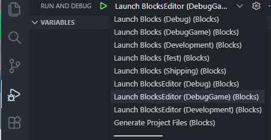
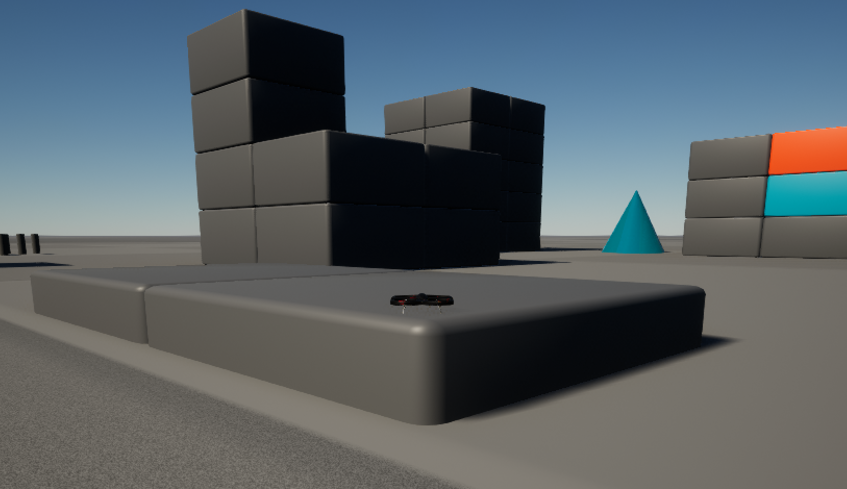

# XV3DGS-AirSim
Language: **English** | [Read in Chinese](README_zh.md)

A workflow for flying drones/driving cars in a Real2Sim setup.

## Dependencies
- Windows 10 or newer
- Python 3.10
- Unreal Engine 5.2, recommended to install via Epic Launcher
- Visual Studio 2022, used only as a build environment (no GUI development here). It is recommended to stay on VS 2022 (not newer versions), and install Desktop development with C++, VS MSVC v143 14.37.32822, and VS 2022 C++ x64/x86 build tools
- Visual Studio Code
- Several good videos for COLMAP (optional)

## Usage Overview
**Use UE 5.2 + Windows**. Following the [official guide](https://github.com/xverse-engine/XScene-UEPlugin/blob/main/UEPlugin/README_CN.md), download the 5.2 plugin from the official releases page, unzip it into the `Plugins` folder, and launch the project. Next, you do not have to use the official [Windows local 3DGS training script](https://github.com/xverse-engine/XScene-UEPlugin/tree/main/UEPlugin#local-training-on-windows-platform); you can also use your own method. As long as you follow the official [capture notes](https://github.com/xverse-engine/XScene-UEPlugin/blob/main/UEPlugin/Media/CaptureDOC_CN.md) to record a proper mp4, you can train a decent `.ply` point cloud and easily import it into Unreal Editor using the [XV3DGS plugin](https://github.com/xverse-engine/XScene-UEPlugin/blob/main/UEPlugin/README_CN.md#%E5%AF%BC%E5%85%A5%E4%BD%A0%E8%87%AA%E5%B7%B1%E7%9A%84-guassian-splatting-%E5%9C%BA%E6%99%AF). The official plugin also provides various [features](https://github.com/xverse-engine/XScene-UEPlugin/tree/main/UEPlugin#feature-introduction) (such as affine transforms, clipping, lighting, and recoloring), which are not repeated here. For very detailed AirSim usage, refer directly to the ProjectAirSim docs: https://iamaisim.github.io/ProjectAirSim/index.html


## Setup
After installing all dependencies, assume you have already completed SfM and 3DGS reconstruction from your own video (or provided assets), and obtained a corresponding `.ply` point cloud file. You now need to import it into a UE project while retaining ProjectAirSim's robot control capabilities. Below is an example workflow (assuming both UE and this project are on drive D). First, clone the project:
```powershell
cd D:\projects

git clone https://github.com/superboySB/XV3DGS-AirSim
```

Open `Developer Command Prompt for VS 2022` to build the integrated environment. Note that UE 5.2 does not support the newer preinstalled MSVC compiler 14.4+, so you need to switch the compiler environment. To switch drive letters, directly input `D:`. Then run the build script and keep your network connection available.
```powershell
"C:\Program Files\Microsoft Visual Studio\2022\Professional\VC\Auxiliary\Build\vcvars64.bat" -vcvars_ver=14.37.32822

# D:
cd .\projects\XV3DGS-AirSim\ProjectAirSim\

build.cmd simlibs_debug
```
Then you can return to `Windows Terminal` and generate Visual Studio project files based on the sample project. Make sure to use UE version `5.2`.
```powershell
cd D:\projects\XV3DGS-AirSim\ProjectAirSim\unreal\Blocks


$env:UE_ROOT = "D:\games\UE_5.2"

.\blocks_genprojfiles_vscode.bat
```
Then in Visual Studio Code, use `Open Workspace from File` to open `Blocks.code-workspace`, and test in this standalone workspace. Note that in `ProjectAirSim\.vscode\cmake-variants.json`, system settings `win64/linux64` and `Debug/Release` are independent. For the rest, carefully follow the VS Code setup guide here: https://iamaisim.github.io/ProjectAirSim/development/use_source.html#vs-code-windows-linux

Wait patiently for all configuration progress bars to finish, then make sure to run `build` (it is also recommended to run `ctest`). After that, you can open UE Editor in GUI.



Startup (brief): launch BlocksEditor first and click Play in Editor. The default scene is empty; you need to run a client script to load scene config before the drone appears. Install the API Python package, then run the example script:
```powershell
python -m pip install -e .\ProjectAirSim\client\python\projectairsim

cd ProjectAirSim\client\python\example_user_scripts

python hello_drone.py
```

After running `hello_drone.py`, you will see the main simulation window plus 3 camera windows (ChaseCam, RGB-Image, Depth-Image), used for chase view and downward RGB/depth images.


## Common Usage Example (New)
Build the ProjectAirSim plugin first (Release is recommended):
```powershell
"C:\Program Files\Microsoft Visual Studio\2022\Professional\VC\Auxiliary\Build\vcvars64.bat" -vcvars_ver=14.37.32822

# D:
cd .\projects\XV3DGS-AirSim\ProjectAirSim\

build.cmd clean

build.cmd simlibs_release
```

Then copy the ProjectAirSim plugins into this project's `Plugins` (alongside `XV3dGS`):
```powershell
# Recommended per the official use_plugin docs: copy Plugins from the packaged UE plugin bundle
# If you build from this repository source, you can copy directly from Blocks/Plugins
Copy-Item -Recurse -Force .\ProjectAirSim\unreal\Blocks\Plugins\ProjectAirSim .\Plugins\
Copy-Item -Recurse -Force .\ProjectAirSim\unreal\Blocks\Plugins\Drone .\Plugins\
Copy-Item -Recurse -Force .\ProjectAirSim\unreal\Blocks\Plugins\Rover .\Plugins\
```

Then compile the Editor module once:
```powershell
$env:UE_ROOT = "D:\games\UE_5.2"

.\xv3dgs_build_editor_development.bat
```

Finally, launch the editor and run the client script: open `XV3DGS.uproject`, then run the client script (see the `hello_drone.py` example in "Setup" above) to load scene config.


At this point, you can also build based on an existing `.umap` (mixing existing UE assets, 3DGS assets, and robots is all fine). Here we assume a from-scratch workflow: create a new open-world level, then use the XV3DGS plugin to import a preferred `.ply` file. You can download some commonly used pretrained 3DGS [ply files](https://repo-sam.inria.fr/fungraph/3d-gaussian-splatting/datasets/pretrained/models.zip), and import selected trained `.ply` files.
[](https://postimg.cc/N5dFspH0)

Then wait briefly and you will see a generated result; drag the blueprint class into the level.
[](https://postimg.cc/1fW9DXMR)

You will most likely need to rotate/translate the imported uassets so the ground aligns as much as possible with your intended ground plane and to find a clear rendering position. In addition, you can refer to the XVerse official [guide](https://github.com/xverse-engine/XScene-UEPlugin/tree/main/UEPlugin) for clipping, recoloring, lighting, etc. You can achieve an effect like this. (The current plugin does not support very large scenes well.)
[](https://postimg.cc/75dXG123)
Note that all of this coexists with ProjectAirSim behavior. Have fun!

<!-- ## Old Usage Example
The following content mainly applies to the old AirSim plugin workflow and is kept for reference.
Then right-click `XV3DGS.uproject` in the source directory and generate the corresponding VS project index.
[](https://postimg.cc/0zYYXGw0)

Open `XV3DGS.sln`. Wait until VS 2022 finishes parsing (lower-left status) before doing anything else. Ensure this project is set as the startup project, then start the local Windows debugger in `Developer Editor` mode, and you will see an empty map.
[](https://postimg.cc/Q98HbwLc)

Set Game Mode to `AirSim Mode`.
[](https://postimg.cc/LqMTH9fR) -->


<!-- Then insert a Player Start as the initial point for AirSim.
[](https://postimg.cc/2b7KF3p8)
Current AirSim `settings.json` is shown below, using a car as a simple example. You can switch to PX4 aircraft, integrate ROS/ROS2 for topics, use more complex sensors, directly control with a gamepad or steering wheel, etc. These features are still available; see official docs for details.
```json
{
    "SettingsVersion": 1.2,
    "SimMode": "Car"
  }
```
Finally, click Play to run the simulation in Editor. The basic effect is shown below. RGB capture works well at present, while depth and semantics are not yet available. This setup can also be packaged, and supports further secondary development on AirSim source code and UE scenes. We also hope XVerse can **improve this plugin soon**.
[](https://postimg.cc/7fVWT53B)
[](https://postimg.cc/ZB8ctQjf) -->


## Acknowledgement
The work was done when the author visited Qiyuan Lab, supervised by [Chao Wang](https://scholar.google.com/citations?user=qmDGt-kAAAAJ&hl=zh-CN).
